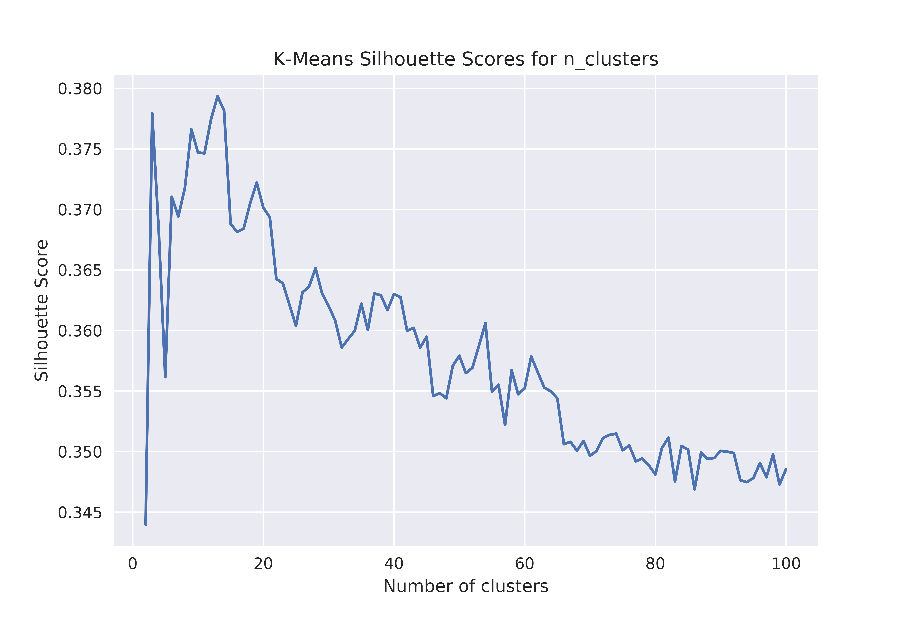

# A Deep Dive into Reddit Comments
**Clustering reddit comments and subreddits**
 Walker Stevens
\
[Linkedin](https://www.linkedin.com/in/walker-stevens-31783087/) | [Github](https://github.com/walker777007)
\
[Slides](https://docs.google.com/presentation/d/1QkEkJUW1XqevWUOdSR_jPeH1tglSzEwxV0EEx10kcIc/edit?usp=sharing)

## Table of Contents

* [Motivation](#motivation)
* [Data Exploration](#data-exploration)
  * [Pipeline](#pipeline)
* [Emotional Sentiment Analysis](#emotional-sentiment-analysis)  
* [Topic Modeling](#modeling)
  * [GloVe Word2Vec](#glove-word2vec)
  * [T-distributed Stochastic Neighbor Embedding](#t-distributed-stochastic-neighbor-embedding)
  * [K-Means Clustering](#k-means-clustering)
* [Conclusion](#conclusion)

## Motivation

I've used reddit over the years, and I was curious how some of the more popular subreddits were related to each other.  [Reddit](https://reddit.com) covers a lot of topics, from sports, video games, food, film, and much more.  My idea is to represent all of these topics by collecting reddit comments and clustering them together so I could essentially show the common themes and topics people are talking about, and the common ties between certain subreddits.

## Data exploration

### Pipeline

Where I got the data:
* [Google Big Query](https://bigquery.cloud.google.com/dataset/fh-bigquery:reddit_comments)

I queried the reddit_comments database on Google Big Query, specifically looking at comments between January and September of 2019.  Querying only long form comments (over 100 characters and excluding links and other forms of unhelpful punctuation), I picked the top comments from 101 active subreddits, which represent a fairly diverse set of topics.  The entire list of subreddits I picked can be seen [here](https://github.com/walker777007/A-Deep-Dive-into-Reddit-Comments/blob/master/listofsubreddits.txt).  

Once all the indivudal CSV files were queried using SQL, I used pandas in order to group them into dataframes, and proceeded to do all my calculations and tests after.  I originally had over 10 million comments in total, but due to computation time, I had to cut it down to a total of 1,010,000 comments (10,000 per subreddit).  Even with a million comments, computation time was still pretty steep, so I used an AWS EC2 instance for the more heavy calculations.

Ignoring stop words, the corpus contained 253,725 unique words and each comment had an average length of ~ 27 words.

The most common words can be seen below.  They tend to be generic, albeit non-stopwords.  As we will see later, these words don't have nearly the impact in clustering topics as other specific words will:

One interesting I had noticed in the data, was the discrepancy in the comment lengths between gender based subreddits.  

## Emotional Sentiment Analysis

Using the [NRC Emotion Lexicon](https://saifmohammad.com/WebPages/NRC-Emotion-Lexicon.htm), I thought it would be interesting to see how the emotional sentiments of certain subreddits compared to each other.  The way the NRC Emotion Lexicon works is that certain words are scored as anger, anticipation, disgust, fear, joy, sadness, surprise, trust and positive, negative.  The way in which I applied this was by essentially parsing each word in the comment and scoring each emotion as the number of emotional words divided by the total amount of words in the comment, and then averaging this number for each subreddit.  Here we can see the top 10 subreddits for the emotions of anger, joy (I call it happy), and sadness.

As well, I decided to use t-distributed stochastic neighbor embedding (which I will explain later) in order to reduce the 10 dimension emotion vector of each subreddit into 2 dimensions, which visually represents the "emotional position" of each subreddit in relation to each other.

The cluster of subreddits in the top left corner tend to be the negative sentiment subredits, as we can see by the inclusion of all the political ones and r/depression.  Interestingly enough, freefolk, the game of thrones subreddit, and StarWars are close by (It seems like those fanbases are prickly).  On the middle right edge of the plot, we can see the happier subreddits, including the animal themed ones as well as r/wholesomememes and r/HumansBeingBros which are both explicitly based on being positive subreddits.

## Topic Modeling

In order to vectorize the comments, I contemplated using several NLP techniques such as:
* **[TF-IDF](https://en.wikipedia.org/wiki/Tf%E2%80%93idf)**: Term frequency–inverse document frequency reflects how important words are to a corpus.
* **Count Vectorize**: Simply converts the corpus into word counts
* **[Word2Vec](https://en.wikipedia.org/wiki/Word2vec)**: Produces word embeddings through a neural network.  This means that each word's meaning is represented by a vector. For example, the vector "king" -"man" would result in the "queen" vector.  
* **[Doc2Vec](https://medium.com/wisio/a-gentle-introduction-to-doc2vec-db3e8c0cce5e)**: Building upon Word2Vec, Doc2Vec essentially tries to embed the contextual meaning of each document

After much debate, the method I ended up using was Word2Vec.  By getting each embedding for a word in the comment and then taking the mean of all the component vectors, each comment can be seen as being the collection of all of its individual word meanings.  So if the comment is "I love food", the comments vector can be seen as the average of the individual meanings of "love" and "food".

### GloVe Word2Vec

I contemplated training my own Word2Vec on my corpus, but I learned there are publicly available trained Word2Vec models such as the [Google News model](https://code.google.com/archive/p/word2vec/) and the [GloVe twitter model](https://nlp.stanford.edu/projects/glove/).  Trained on over 2 billion tweets, I decided to use the GloVe model, since my assumption is reddit comments will likely have similar contextual meanings as tweets.  The model was directly downloaded through the [Gensim package on Python](https://radimrehurek.com/gensim/auto_examples/howtos/run_downloader_api.html).  Each word in the GloVe twitter model is represented by a 200 dimensional vector, and contains a vocabulary of 1.2 million words.

### T-distributed Stochastic Neighbor Embedding

Once I had the feature matrix, a 1,010,000 by 200 array, I needed a way to reduce its dimensionality in order to visually cluster them. A method that preserves high dimensional clusters and geometry would be ideal, and [t-distributed stochastic neighbor embedding](https://en.wikipedia.org/wiki/T-distributed_stochastic_neighbor_embedding) (TSNE) does this.  First it constructs a probability distribution over high dimensional objects in such a way that similar objects have a high probability of being picked while dissimilar points have a low probability of being chosen. It then creates a similar probability distribution over the points in the low-dimensional map, minimizing the [Kullback–Leibler divergence](https://en.wikipedia.org/wiki/Kullback%E2%80%93Leibler_divergence) between the two distributions with respect to the locations of the points in the map.  If you want to play around with pretty graphs while getting an understanding of how this process works, [this interactive article](https://distill.pub/2016/misread-tsne/) helped me a lot.

Here we can see the result of TSNE on all of our comments, including the means of the subreddits overlayed.

As we can see in the zoomed in case and the case above it, the methods applied were able to group together similar subreddits.  The food subreddits are very distinct from the rest, and the sports politics, animals subreddits form their own individual clusters.  To my surprise, the meme subreddits tend to be clustered as well, which I doubted since they tend to cover multiple different topics, albeit with similar humor.  However, the more vague and popular subreddits seem to be a bit looser in the clustering, and fall mainly in the middle "blob".

### K-Means Clustering

[K-means clustering](https://en.wikipedia.org/wiki/K-means_clustering) is a method of grouping data into similar groups by minimizing the within-cluster variances (squared Euclidean distances).  Picking the ideal number of clusters can be tough, as each can have different interpretations.  For example, a few clusters may separate overarching topics while a larger number may pick out smaller differences, albeit with possible higher overlap.  In order to decide the ideal number, I took a random sample of 1000 comments from each subreddit (silhouette scoring is computationally heavy) and looked at the silhouette scores of 2-100 clusters.  The [silhouette score](https://en.wikipedia.org/wiki/Silhouette_(clustering) measures how similar an object is to its own cluster by through the use of a distance metric, and it ranges from -1 to 1.

We can see that the lower numbers produce higher scores, but there are periodic peaks which reveal that there is an underlying subtopic split that can be learned.  I went with 61 clusters, as I wanted to produce the maximum number of subtopics without excessive overlap.

Here we can see the silhouette score of 61 clusters along with a visual represntation:

And here we an get a look at the cluster on the original 1 million + dataset:

However, if we cluster first and then apply TSNE, we can see that the cluster shapes are preserved much better, as the polygon-esque shapes dissapear.  But the downside of this, is that we can't plot the centroids, as they exist in 200 dimensional space, so the cluster locations are less interpretable.

Here are some examples of the topics the clustering was able to pick up, using some of the nearest comments to the cluster centroid:

* **Cluster 0**: "Travel"
  * St George is a cool place! Just had Nielsons Frozen Custard and was very pleased. Will definitely come back for more Zion and hikes around the area
  * They use haystack as a reference point for finding the cave. Cannon beach where haystack rock is wasn’t actually in the movie though. It was filmed up in Astoria.
  * Hey, this was here in Croatia! The guy couldn't afford a ticket so he used the umbrella to get to an island from the shore. It was this summer.

* **Cluster 11**: "Finance"
  * You are being conservative. Lot of folks here are out-doing each other on their conservative-ness (I mean, 3% long term returns, come on! Buy some 30 year treasury bonds if you’re that dismal on the future).
  * Strong growth story. Similar to many others in China. Really uncertain how it will fare. That said its probably the cheapest growth you can buy, but it comes with massive market and government risk. High risk high reward. Not a bad buy but a risky and long term one.
  * The underlying economy remains strong and feds will continue to lower rates if it starts to falter. Of course it won’t last forever but I feel this market still have some legs. This tariff thing is just noise on the market and a good opportunity.

* **Cluster 14**: "Movies (Marvel/Star Wars)"
  * What an experience. Here are my initial thoughts, could change. This move was extremely epic, very entertaining, and thoroughly satisfying. It definitely has some of the very best moments in all of the MCU. I think you could make the argument Infinity War was a better movie, and I think I would agree with that. But what we got was such an awesome conclusion and a huge thank you to all of the fans. It was a very different movie than IW and was exactly what it needed to be. I loved it.
  * I really like this character in the MCU. I scoffed when I first heard they were making a solo movie but I really enjoyed it. I never thought I would say that about Ant-Man.
  * Rogue One made some mistakes but the Death Troopers sure as hell aren’t one of them. Ever since I first saw these guys they became my favorite trooper by far. I just didn’t like that they suddenly became as incompetent as a battle droid, right after the movie showed us how lethal they are.

* **Cluster 17**: "Sports (Football/Basketball/Baseball)"
  * Roger Goodell banned touchdown celebrations for years, I don’t  think it’s safe to assume what the NFL considers viewership draws
  * "Mike Trout is back in the lineup tonight, although as DH so he'll only be making mortal contributions to his WAR."
  * Shaquille O'Neal's response to a rookie Dwight Howard trying to get in his head while Shaq was at the FT line: "Rook, I am the worst fucking shooter in the league. In the league, understand? And you're up here trying to f*cking tell me something?" Shaq stared down Dwight after missing both free throws.

* **Cluster 21**: "Politics (Trump)"
  * The problem is Trump will have to sign it or a veto override will be required. Neither is likely to occur.
  * He knows exactly how subpoenas work.  He's just trying to punt his hearing until after Barr's confirmation. If he receives written assurances he won't be subpoenaed, he won't show. If he gets subpoenaed, he fights it in court and won't show until after Barr is confirmed by the senate.
  * Congress passed a law that granted the president the authority to "from time to time, withdraw from disposition any of the unleased lands of the outer Continental Shelf". The Trump administration claimed this grant implicitly included the authority to put lands back into disposition afer they had been withdrawn. The judge disagreed, reasoning that if Congress had meant to grant the president that authority it would have done so explicitly. The judge made a defensible call and very possibly the right one. And I say this as someone who thinks many of the rulings against the Trump administration have been wrong and politically-biased.

* **Cluster 24**: "Animals (Cats/Dogs)"
  * The best mix. Our Isabel is extremely attentive, loves kids and other dogs and just about any creature you introduce her to. Enjoy life together!
  * My wife did this (herself, not as a shelter) for years - so now we have 13 formerly unadoptable kitties getting older with us. Even rascally semi-feral kitties can benefit from a forever home, so thank you for taking on the challenge!
  * Indeed she is. she puts up with a lot! Especially me, her mother who insists on dressing her up for holidays and walking her on a leash for exercise.

* **Cluster 28**: "Music"
  * No Time was one of the best songs from 2018, so hoping this Carti Gunna song is from the same session when they were recording that. And what do you mean you were hoping for something shorter? This is going to be a total of like 45 min max lol
  * It's one of those perfect examples of a music video that elevates a song to another level of enjoyability. They work in tandem so smoothly that it would probably be worse with any other combination.
  * Nobody in Slipknot should ever insult another band. They’re like metal for 12 year olds who just discovered the genre. Plus Corey Taylor should honestly just shut the fuck up. He's the lead singer of Stone Sour who are easily in the conversation with these other shit shows as "worst band ever".

* **Cluster 33**: "Cars"
  * Lowering kit, underglow, cat delete, autozone special 'CAI', a couple decals, shiny chrome rims, and a ridiculous amount of camber. Bugatti Chirice.
  * Is this one of those new cars where they make it hard to photograph while test driving them in real life?
  * My sister bought a used Dodge Caliber. I feel like it's a strong contender in this battle. That car has given me an existential crisis regarding manuals. It is without a doubt the worst manual I've ever driven, making me ask "is an awful manual better than a 4 speed automatic?"

* **Cluster 38**: "Video Games"
  * It also includes a pokedex of all pokemon introduced in that gen. I had one for Black/White when I was a kid and I loved reading it.
  * Wow, what an informative response! Very interesting. The gamer in me wants to relate this to Battlefield V. The German Stuka is in the game and has that crazy unique whine and it’s very cool. However all prop planes in the game also have a similar whine so that bit of information was new to me!
  * It's still crazy to me that for a lot of kids, Minecraft was 90% about watching Youtube videos. There was this whole enormous kids' culture of Minecraft going on while we were just university students playing on a server together.

* **Cluster 40**: "Clothes/Fashion"
  * How do people wear this in the summer? I'm sweating in a button-up and jeans, let alone another layer on top. But whenever I go to Europe people are wearing like four layers. Has AC just made me weak?
  * Honestly, I feel like every other color than the black/white compliments the shoes so well. Pink is definitely my fav rn
  * I like the outfit with the jacket on! Keeps it simple and clean. Without the jacket, the hoodie sleeves are a bit overwhelming. Also dope choice in eyewear. I’ve been looking at the Damir Doma collabs for a while, but they haven’t dropped in price for the past year!

* **Cluster 43**: "Food"
  * It's almost like eating like a whipped yogurt meets angel food cake, at least from a texture standpoint.  The flavor is just not good.  It's kind of an odd bland flavor, kind of like meringue or something.
  * Similarly with vegan chocolate, it doesn’t taste as rich Which is funny because high-end dark chocolate is often accidentally vegan.
  * It's VERY safe since the ink is sterile and the paper is clean.  Serve fish n' chips on it a lot.  Clam/lobster/shrimp boils too. Lay it all out on the table and nosh on!

* **Cluster 54**: "PC/Camera Hardware"
  * I've posted before that I felt the current Fuji is what Pentax should've been. Remember when the K7 came out? It was a small body that could take a beating, a hint of retro styling before full retro styling became fashionable again. They had these adorable limited primes that at that point no one else did. Pentax users were loyal and viciously defensive (they still are lol), and as a whole the Pentax concept was kind of, well...quirky. THAT'S the perfect company to produce small mirrorless retro-styled cameras that don't rely on cutting edge technology. Fuji XT100, Olympus Pen, where's the mirrorless K1000, Pentax?
  * SSDs.  Honestly, I thought they were just for the boot partition, and nothing else. Built a high end PC with a 1tb ssd about 3 years back, thinking I'd have to get a a hard drive etc..... will never buy spinning metal again. edit : I kind of jumped on the bandwagon at exactly the right time, to be honest.  Got a decent deal for a 1tb SSD 3 years ago, and thought I might upgrade later.  SSD prices remained pretty much stable for 2 years after that, it's only recently they've come down. edit2 : Also, the upgrading of my internet account made a difference.  I used to be on 2mbps.  Now I can delete games and reinstall them without the 24 hour+ wait.
  * All of MSIs and Gigabytes Mid range B450 and above have Bios Flashback. I can't remember for other vendors.

  Other topics included life advice, guns, philosophy/logic, fitness, and more.  Others seemed to focus on language rather than content.  One specifically had many comments that used % and $ symbols, and another specifically had comments explicitly referencing subreddits, so a lot of 'r/' tokens.

## Conclusion

With the techniques I applied, it seems very possible to be able to divide text into multiple thematic or language groupings based on their content.  This can be applied across several fields, and categorizing text has a near infinite amount of uses.  
For my own goal, it appears that subreddits have quite a lot of common themes and shared emotional sentiments.  In the future I'd like to apply the Google News Word2Vec model, and ideally train my own Word2Vec or Doc2Vec model as it would likely be even better at dividing comments since it would be trained on reddit's vocabulary.
