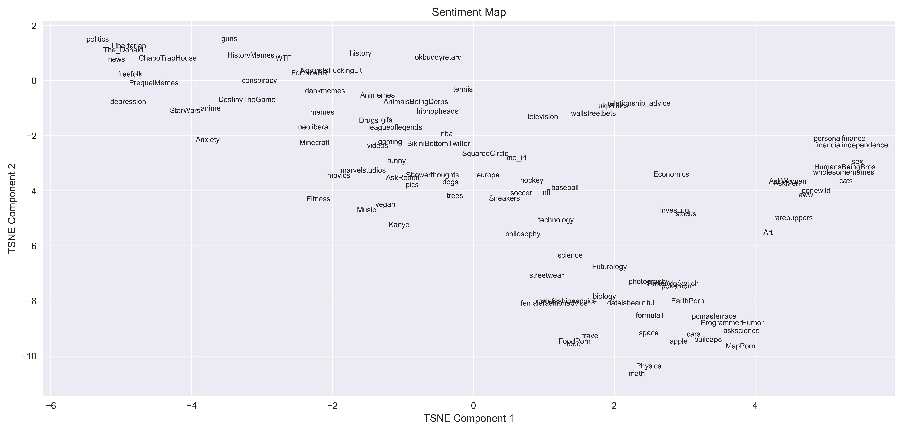

# A Deep Dive into Reddit Comments
**Clustering reddit comments and subreddits**
 Walker Stevens
\
[Linkedin](https://www.linkedin.com/in/walker-stevens-31783087/) | [Github](https://github.com/walker777007)
\
[Slides](https://docs.google.com/presentation/d/1QkEkJUW1XqevWUOdSR_jPeH1tglSzEwxV0EEx10kcIc/edit?usp=sharing)

## Table of Contents

* [Motivation](#motivation)
* [Data Exploration](#data-exploration)
  * [Pipeline](#pipeline)
* [Emotional Sentiment Analysis](#emotional-sentiment-analysis)  
* [Topic Modeling](#modeling)
  * [GloVe Word2Vec](#glove-word2vec)
  * [T-distributed Stochastic Neighbor Embedding](#t-distributed-stochastic-neighbor-embedding)
  * [K-Means Clustering](#k-means-clustering)
* [Conclusion](#conclusion)

## Motivation

I've used reddit over the years, and I was curious how some of the more popular subreddits were related to each other.  Reddit(https://reddit.com) covers a lot of topics, from sports, video games, food, film, and much more.  My idea is to represent all of these topics by collecting reddit comments and clustering them together so I could essentially show the common themes and topics people are talking about, and the common ties between certain subreddits.

## Data exploration

### Pipeline

Where I got the data:
* [Google Big Query](https://bigquery.cloud.google.com/dataset/fh-bigquery:reddit_comments)

I queried the reddit_comments database on Google Big Query, specifically looking at comments between January and September of 2019.  Querying only long form comments (over 100 characters and excluding links and other forms of unhelpful punctuation), I picked the top comments from 101 active subreddits, which represent a fairly diverse set of topics.  The entire list of subreddits I picked can be seen [here](https://github.com/walker777007/A-Deep-Dive-into-Reddit-Comments/blob/master/listofsubreddits.txt).  

Once all the indivudal CSV files were queried using SQL, I used pandas in order to group them into dataframes, and proceeded to do all my calculations and tests after.  I originally had over 10 million comments in total, but due to computation time, I had to cut it down to a total of 1,010,000 comments (10,000 per subreddit).  Even with a million comments, computation time was still pretty steep, so I used an AWS EC2 instance for the more heavy calculations.

Ignoring stop words, the corpus contained 253,725 unique words and each comment had an average length of ~ 27 words.

The most common words can be seen below.  They tend to be generic, albeit non-stopwords.  As we will see later, these words don't have nearly the impact in clustering topics as other specific words will:

One interesting I had noticed in the data, was the discrepancy in the comment lengths between gender based subreddits.  

## Emotional Sentiment Analysis

Using the [NRC Emotion Lexicon](https://saifmohammad.com/WebPages/NRC-Emotion-Lexicon.htm), I thought it would be interesting to see how the emotional sentiments of certain subreddits compared to each other.  The way the NRC Emotion Lexicon works is that certain words are scored as anger, anticipation, disgust, fear, joy, sadness, surprise, trust and positive, negative.  The way in which I applied this was by essentially parsing each word in the comment and scoring each emotion as the number of emotional words divided by the total amount of words in the comment, and then averaging this number for each subreddit.  Here we can see the top 10 subreddits for the emotions of anger, joy (I call it happy), and sadness.

As well, I decided to use t-distributed stochastic neighbor embedding (which I will explain later) in order to reduce the 10 dimension emotion vector of each subreddit into 2 dimensions, which visually represents the "emotional position" of each subreddit in relation to each other.

The cluster of subreddits in the top left corner tend to be the negative sentiment subredits, as we can see by the inclusion of all the political ones and r/depression.  Interestingly enough, freefolk, the game of thrones subreddit, and StarWars are close by (It seems like those fanbases are prickly).  On the middle right edge of the plot, we can see the happier subreddits, including the animal themed ones as well as r/wholesomememes and r/HumansBeingBros which are both explicitly based on being positive subreddits.

## Topic Modeling

In order to vectorize the comments, I contemplated using several NLP techniques such as:
* **[TF-IDF](https://en.wikipedia.org/wiki/Tf%E2%80%93idf)**: Term frequency–inverse document frequency reflects how important words are to a corpus.
* **Count Vectorize**: Simply converts the corpus into word counts
* **[Word2Vec](https://en.wikipedia.org/wiki/Word2vec)**: Produces word embeddings through a neural network.  This means that each word's meaning is represented by a vector. For example, the vector "king" -"man" would result in the "queen" vector.  
* **[Doc2Vec](https://medium.com/wisio/a-gentle-introduction-to-doc2vec-db3e8c0cce5e)**: Building upon Word2Vec, Doc2Vec essentially tries to embed the contextual meaning of each document

After much debate, the method I ended up using was Word2Vec.  By getting each embedding for a word in the comment and then taking the mean of all the component vectors, each comment can be seen as being the collection of all of its individual word meanings.  So if the comment is "I love food", the comments vector can be seen as the average of the individual meanings of "love" and "food".

### GloVe Word2Vec

I contemplated training my own Word2Vec on my corpus, but I learned there are publicly available trained Word2Vec models such as the [Google News model](https://code.google.com/archive/p/word2vec/) and the [GloVe twitter model](https://nlp.stanford.edu/projects/glove/).  Trained on over 2 billion tweets, I decided to use the GloVe model, since my assumption is reddit comments will likely have similar contextual meanings as tweets.  The model was directly downloaded through the [Gensim package on Python](https://radimrehurek.com/gensim/auto_examples/howtos/run_downloader_api.html).  Each word in the GloVe twitter model is represented by a 200 dimensional vector, and contains a vocabulary of 1.2 million words.

### T-distributed Stochastic Neighbor Embedding

Once I had the feature matrix, a 1,010,000 by 200 array, I needed a way to reduce its dimensionality in order to visually cluster them. A method that preserves high dimensional clusters and geometry would be ideal, and [t-distributed stochastic neighbor embedding](https://en.wikipedia.org/wiki/T-distributed_stochastic_neighbor_embedding) (TSNE) does this.  First it constructs a probability distribution over high dimensional objects in such a way that similar objects have a high probability of being picked while dissimilar points have a low probability of being chosen. It then creates a similar probability distribution over the points in the low-dimensional map, minimizing the [Kullback–Leibler divergence](https://en.wikipedia.org/wiki/Kullback%E2%80%93Leibler_divergence) between the two distributions with respect to the locations of the points in the map.  If you want to play around with pretty graphs while getting an understanding of how this process works, [this interactive article](https://distill.pub/2016/misread-tsne/) helped me a lot.

Here we can see the result of TSNE on all of our comments, including the means of the subreddits overlayed.

